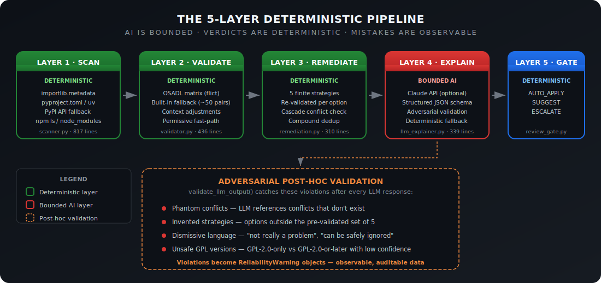
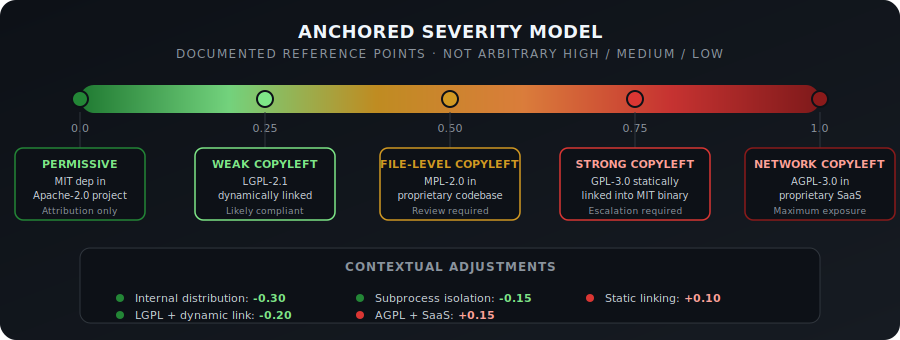

# LicenseStoic

**"Control what you can. Observe what you cannot. Know the difference."**

Self-healing SPDX license compliance for software dependencies. Deterministic verdicts, bounded AI explanations, observable failure modes.


---

## Why AIQA Matters Here

When you put an LLM anywhere near legal compliance, you need structural guarantees that it cannot hallucinate verdicts, invent remediation options, or dismiss conflicts. Most tools either avoid AI entirely or trust it blindly. LicenseStoic takes a third path: the LLM explains things, but a deterministic engine makes every compatibility decision.

### The 5-Layer Architecture

<p align="center">
  
</p>

| Layer | Role | Type |
|-------|------|------|
| **1. Scan** | Resolve dependency tree and extract license identifiers from metadata, classifiers, and APIs | Deterministic |
| **2. Validate** | Check pairwise compatibility against OSADL matrix with context-aware adjustments | Deterministic |
| **3. Remediate** | Enumerate exactly 5 fix strategies; re-validate each against all constraints | Deterministic |
| **4. Explain** | LLM explains conflicts in plain language and ranks pre-validated options by cost | **Bounded AI** |
| **5. Gate** | Classify each conflict as AUTO_APPLY / SUGGEST / ESCALATE based on severity thresholds | Deterministic |

### The AIQA Boundary

Layers 1-3 and 5 are fully deterministic. Layer 4 is the only place the LLM touches anything, and its permissions are narrow:

It can explain conflicts in plain language (2-4 sentences per conflict), rank pre-validated remediation options by engineering cost, and classify ambiguous license texts from legacy metadata or non-SPDX strings.

It cannot override compatibility verdicts (that's the OSADL matrix via `validator.py`), invent remediation strategies (the deterministic engine has a finite set of 5), dismiss or downplay conflicts (adversarial validation catches this), or provide legal advice (the system prompt explicitly prohibits it).

### Adversarial Post-Hoc Validation

After every LLM response, `validate_llm_output()` checks its output against the deterministic ground truth:

| Violation | What it catches |
|-----------|----------------|
| **Phantom conflicts** | LLM references conflicts that don't exist in the validated set |
| **Invented strategies** | LLM suggests options outside the pre-validated set of 5 |
| **Dismissive language** | "not really a problem", "can be safely ignored", "doesn't actually matter" |
| **Unsafe GPL versions** | GPL-2.0-only vs GPL-2.0-or-later classified with confidence < 0.7 |

Violations become `ReliabilityWarning` objects in the scan result. They show up in the terminal report and the JSON output alongside the conflicts themselves. The LLM's mistakes are data you can audit, not silent failures.

No API key? Layer 4 falls back to a deterministic stub that fills in template-based explanations. The pipeline works end-to-end without any LLM calls.

---

## What It Does

- Scans Python dependencies via `importlib.metadata` (PEP 639), `pyproject.toml`, `uv` temp venv resolution, and PyPI JSON API fallback
- Scans npm dependencies via `npm ls --json --all` with `node_modules` enrichment fallback
- Imports existing SPDX 2.3 JSON SBOMs
- Validates all dependency licenses against your project license using the OSADL matrix (via `flict`), with a built-in fallback matrix of ~50 common pairs
- Understands distribution type (binary, source, SaaS, internal, library) and integration type (static link, dynamic link, subprocess, build tool, test/dev only)
- Scores severity on a 0.0-1.0 scale with 5 documented anchor points, not arbitrary high/medium/low
- Enumerates exactly 5 remediation strategies (replace, relicense, commercial license, restructure, remove), each re-validated against the constraint engine
- Optionally calls Claude API for plain-language explanations; works fully without it
- Gates every conflict into `AUTO_APPLY` / `SUGGEST` / `ESCALATE` tiers
- Outputs Rich terminal reports with severity bars, plus JSON for CI/CD
- Accepts git URLs: `https://`, `git@`, or `owner/repo` GitHub shorthand
- Surfaces reliability warnings when scan confidence degrades (deep transitive deps, unknown licenses, non-SPDX texts)

---

## Quick Start

```bash
# Install
pip install licensestoic

# Scan current directory (auto-detects project license)
licensestoic .

# Scan with explicit license
licensestoic . --license MIT --distribution binary

# Scan a GitHub repo
licensestoic owner/repo --license MIT

# Scan a specific branch
licensestoic owner/repo --ref main --license Apache-2.0

# Scan with LLM explanations
export ANTHROPIC_API_KEY=sk-ant-...
licensestoic . --license MIT

# Import an existing SBOM
licensestoic . --sbom path/to/sbom.spdx.json

# Export JSON report for CI/CD
licensestoic . --json-report report.json

# Verbose mode for debugging
licensestoic . --license MIT -v
```

Exit codes: `0` = no conflicts (clean scan), `1` = conflicts present (requires review).

---

## How It Works

### Layer 1 — Scanning

**`scanner.py` · 817 lines**

Multi-strategy resolution cascade with per-source confidence tracking. Resolution priority: `importlib.metadata` (PEP 639 `License-Expression` at 0.95 confidence, then legacy `License` field at 0.7, then classifier-to-SPDX mapping at 0.9), followed by `pyproject.toml` stubs, `uv` temp venv resolution for uninstalled packages, and PyPI JSON API fallback at 0.3 confidence. Transitive dependencies are discovered via BFS walk of `importlib.metadata.requires()`. npm scanning runs `npm ls --json --all` with `node_modules/*/package.json` enrichment as fallback. Each `DependencyNode` carries its license identifiers, confidence score, and resolution source.

### Layer 2 — Validation

**`validator.py` · 436 lines**

This layer is the correctness authority. When `flict` (the OSADL matrix CLI) is installed, it delegates pairwise compatibility checks to the full OSADL dataset. Otherwise, it falls back to a built-in matrix of ~50 common license pairs. Universally permissive licenses (`0BSD`, `CC0-1.0`, `Unlicense`, `ISC`, `Zlib`, `BSL-1.0`, `WTFPL`) get a fast-path: always compatible as inbound, checked before the matrix. Integration context matters: LGPL + dynamic link produces `CONTEXT_DEPENDENT` instead of hard `INCOMPATIBLE`. Subprocess isolation weakens copyleft propagation. Build-only, test-only, and dev-only dependencies are excluded from conflict analysis entirely. Compound AND expressions use dual-license semantics: if ANY identifier in the expression is compatible, the package passes.

### Layer 3 — Remediation

**`remediation.py` · 310 lines**

There are exactly 5 strategies, each with a feasibility score:

| Strategy | Feasibility | Description |
|----------|-------------|-------------|
| `REPLACE_DEPENDENCY` | 0.6 | Swap for a compatible alternative |
| `OBTAIN_COMMERCIAL_LICENSE` | 0.4 | Negotiate dual/commercial license |
| `RESTRUCTURE_INTEGRATION` | 0.4–0.5 | Static → dynamic link, or isolate as subprocess |
| `RELICENSE_PROJECT` | 0.3 | Change project license (re-validated against ALL deps) |
| `REMOVE_DEPENDENCY` | 0.2 | Remove and reimplement or find alternative |

Relicensing suggestions are validated against every dependency to prevent cascade conflicts. Integration restructuring is only suggested when the validator confirms it would actually resolve the conflict (e.g., static to dynamic for LGPL). Compound AND expressions from the same package are deduplicated, so a package with 4 flagged license identifiers produces at most 5 options, not 20.

### Layer 4 — LLM Explanation

**`llm_explainer.py` · 339 lines**

The LLM receives only the validated conflict data and pre-enumerated remediation options. It never sees raw license text or the project codebase. The system prompt explicitly prohibits overriding compatibility verdicts, inventing remediation options, dismissing conflicts, and providing legal advice. After every response, `validate_llm_output()` runs adversarial checks against the deterministic ground truth. When no API key is present, the pipeline uses a deterministic stub that generates template-based explanations instead.

### Layer 5 — Human Review Gate

**`review_gate.py` · 85 lines**

Classifies each conflict into one of three tiers based on severity, unknown license presence, and whether the LLM was involved:

| Tier | Condition | Action |
|------|-----------|--------|
| **AUTO_APPLY** | severity < 0.3 AND deterministic-only | Safe to apply without review |
| **SUGGEST** | severity 0.3–0.7 OR LLM-involved | Present with explanation; user decides |
| **ESCALATE** | severity > 0.7 OR unknown license | Requires legal/expert review |

---

## Severity Model

<p align="center">
  
</p>

| Severity | Scenario | Example |
|----------|----------|---------|
| **0.0** | Permissive → Permissive | MIT dep in Apache-2.0 project |
| **~0.25** | Weak copyleft, dynamic link | LGPL-2.1 dynamically linked |
| **~0.5** | File-level copyleft | MPL-2.0 in proprietary codebase |
| **~0.75** | Strong copyleft, static link | GPL-3.0 statically linked into MIT binary |
| **~1.0** | Network copyleft + SaaS | AGPL-3.0 in proprietary SaaS |

Contextual adjustments shift the score based on how the dependency is actually used:

| Context | Adjustment | Rationale |
|---------|-----------|-----------|
| Internal distribution | -0.30 | No external exposure |
| LGPL + dynamic linking | -0.20 | LGPL design intent |
| Subprocess isolation | -0.15 | Breaks copyleft propagation |
| Static linking | +0.10 | Stronger copyleft claim |
| AGPL + SaaS | +0.15 | Network interaction clause |

All values clamped to [0.0, 1.0].

---

## Test Suite

~2,075 lines of tests covering ~3,156 lines of source across 177 test cases.

| Category | What it covers |
|----------|---------------|
| **Ground-truth compatibility** | OSADL matrix expectations for common license pairs |
| **Parametrized edge cases** | Apache-2.0/GPL-2.0 patent conflict, GPL version bridging, compound AND semantics |
| **Adversarial LLM validation** | Phantom conflicts, invented strategies, dismissive language, GPL version ambiguity |
| **Scanner resolution** | Mocked `importlib.metadata`, subprocess calls, and PyPI API responses |
| **Pipeline integration** | End-to-end runs on temp project directories with known dependency sets |
| **Review gate thresholds** | Tier boundary conditions for AUTO_APPLY / SUGGEST / ESCALATE |
| **Git source handling** | URL parsing, clone behavior, `owner/repo` shorthand |

```bash
# Run tests
uv run pytest tests/ -v

# Run with coverage
uv run pytest tests/ --cov=licensestoic --cov-report=term-missing
```

---

## Configuration & CLI Options

| Flag | Short | Default | Description |
|------|-------|---------|-------------|
| `PROJECT_SOURCE` | — | `.` | Local path, git URL, or `owner/repo` shorthand |
| `--name` | `-n` | auto-detected | Project name |
| `--license` | `-l` | auto-detected | Project SPDX identifier (e.g., `MIT`, `Apache-2.0`) |
| `--distribution` | `-d` | `binary` | Distribution type: `binary`, `source`, `saas`, `internal`, `library` |
| `--ref` | — | — | Git branch, tag, or commit (for git URLs) |
| `--sbom` | — | — | Path to SPDX 2.3 JSON SBOM file |
| `--scancode` | — | disabled | Enable ScanCode Toolkit for deep file-level scanning |
| `--resolve` | — | enabled | Auto-install unresolved deps via `uv` into temp venv |
| `--json-report` | `-o` | — | Save JSON report to file path |
| `--api-key` | — | `$ANTHROPIC_API_KEY` | Anthropic API key for LLM explanations |
| `--verbose` | `-v` | off | Debug-level logging |

---

## Limitations & Roadmap

### Known Limitations

- The built-in matrix covers ~50 common license pairs. Install [flict](https://github.com/vinland-technology/flict) for full OSADL coverage (~3,000+ pairs).
- Python and npm only. No Go, Rust, or Java scanners yet.
- `--resolve` installs packages from untrusted `pyproject.toml` into a temp venv. This is a supply chain risk; sandboxed resolution is planned.
- Compound AND expressions are treated as dual-licensing. This is a pragmatic deviation from strict SPDX semantics (where AND means all terms apply simultaneously), documented intentionally.
- 2 commits in git history. The project was developed locally across multiple sessions before being pushed.

### Roadmap

- GitHub Actions workflow for CI/CD integration
- SPDX 3.0 support (when tooling matures)
- Go, Rust, and Java dependency scanners
- SBOM generation (not just import)
- `flict` auto-installation when missing
- Sandboxed `--resolve` execution
- ScanCode Toolkit integration for file-level license detection in source repos

---

## Project Structure

```
src/licensestoic/
├── scanner.py        817 lines   Layer 1: dependency resolution & license extraction
├── validator.py      436 lines   Layer 2: OSADL matrix compatibility checks
├── llm_explainer.py  339 lines   Layer 4: bounded LLM explanation & adversarial validation
├── remediation.py    310 lines   Layer 3: 5-strategy enumeration & re-validation
├── cli.py            277 lines   Click CLI interface
├── report.py         224 lines   Rich terminal & JSON report generation
├── pipeline.py       209 lines   5-layer pipeline orchestrator
├── models.py         151 lines   Pydantic v2 data models
├── git_source.py     130 lines   Git clone & URL parsing utilities
├── parsing.py         93 lines   SPDX license expression parsing
├── review_gate.py     85 lines   Layer 5: human review tier classification
└── severity.py        82 lines   Risk severity computation with contextual adjustments
                    ─────────
                    3,156 lines total
```

---

## License

MIT
